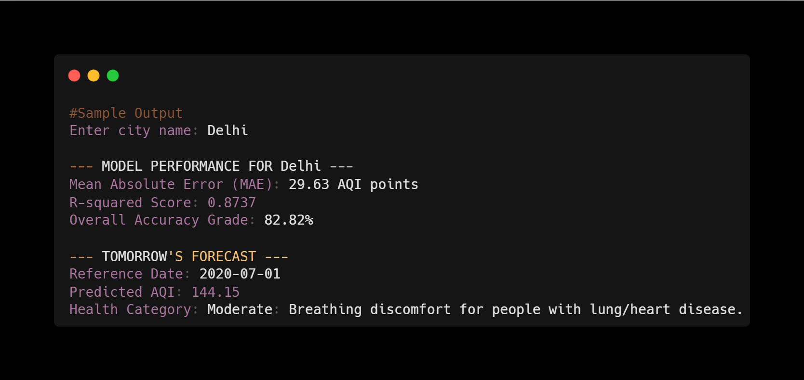
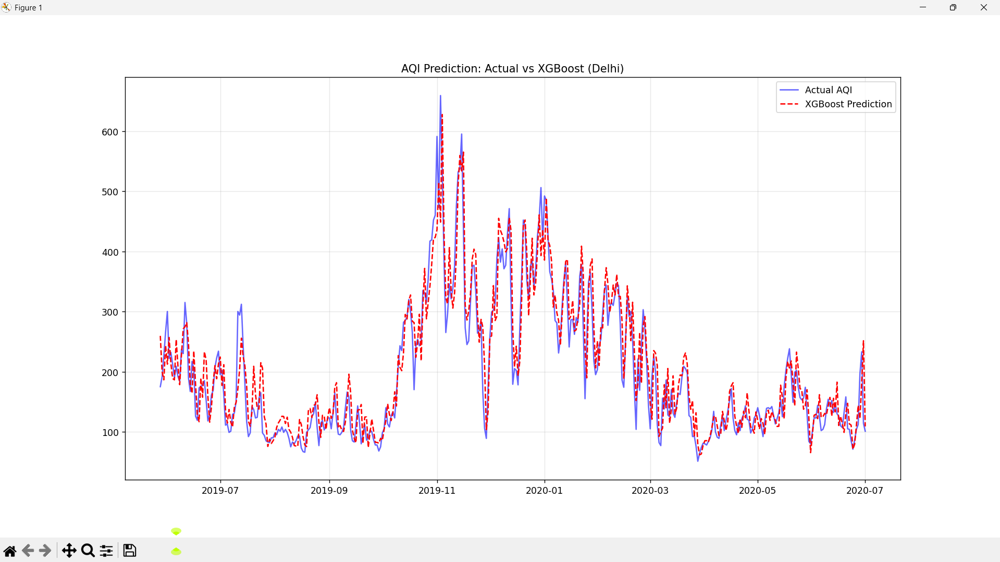
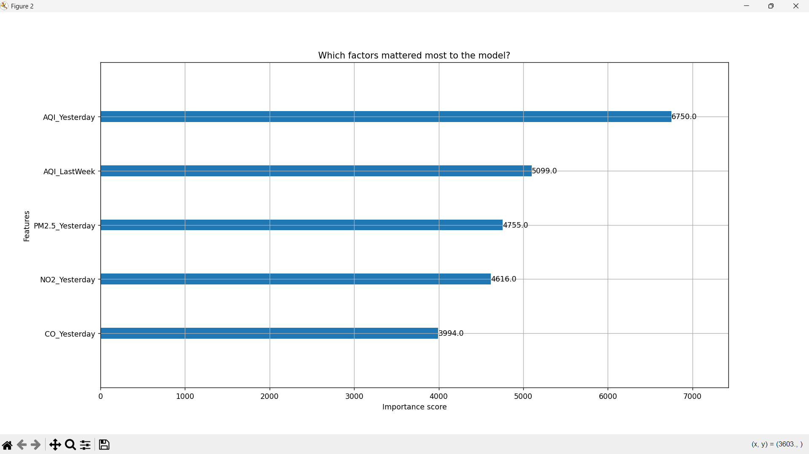
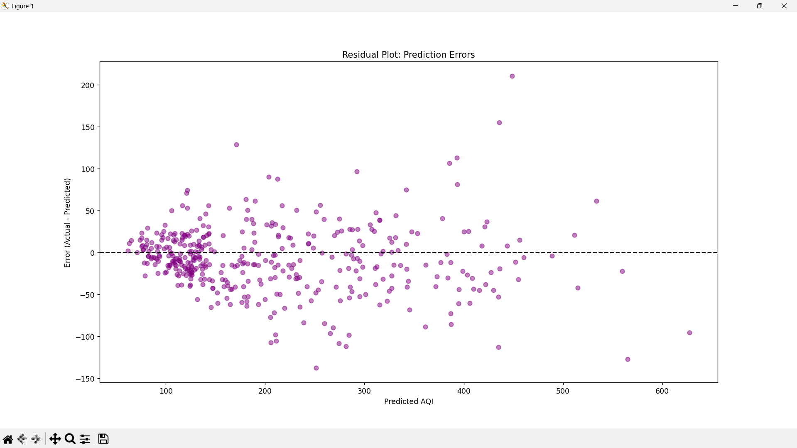

# Air Quality Index (AQI) Forecasting using XGBoost

An end-to-end machine learning project designed to predict the next day's Air Quality Index (AQI) for major cities. This project leverages historical data and gradient boosting to provide actionable health insights.

## 📌 Project Overview
Air pollution is a critical health concern in urban environments. This project aims to:
* **Predict:** Forecast the AQI of a specific city for the next 24 hours.
* **Analyze:** Understand which pollutants (PM2.5, NO2, CO) contribute most to air quality degradation.
* **Inform:** Provide health recommendations based on predicted AQI levels.

## 🛠️ Tech Stack
* **Language:** Python
* **Libraries:** Pandas, NumPy, Scikit-learn, XGBoost, Matplotlib
* **Algorithm:** XGBoost Regressor (Gradient Boosting)

## 🚀 Key Features
* **Time-Series Feature Engineering:** Implemented lag features (Yesterday's AQI and Last Week's AQI) to capture temporal trends.
* **Robust Preprocessing:** Handles missing data using forward-filling (`ffill`) to maintain time-series integrity.
* **Interactive Input:** Users can input any city from the dataset to get a tailored forecast.
* **Performance Metrics:** Evaluated using R-squared ($R^2$), Mean Absolute Error (MAE), and Accuracy Grade.

## 📊 Results
The model demonstrates strong predictive power. For a city like **Delhi**, the model typically achieves:
* **R-squared Score:** ~0.87 (explaining 87% of the data variance).
* **Accuracy Grade:** ~82.8%.


## 📂 How to Run
1. Clone this repository to your local machine.
2. Ensure you have `city_day.csv` in the same folder as the script.
3. Install the required libraries:
   ```bash
   pip install pandas xgboost scikit-learn matplotlib numpy

## 📊 Model Output


## 📈 Prediction Results

### 2. Feature Importance (What drives the prediction?)
This chart shows that **Yesterday's AQI** and **Last Week's AQI** are the strongest predictors, proving that air quality has strong temporal patterns.


### 3. Error Analysis (Residual Plot)
The residual plot shows how our predictions vary from actual values. A random distribution around the horizontal line indicates a well-fitted model.

